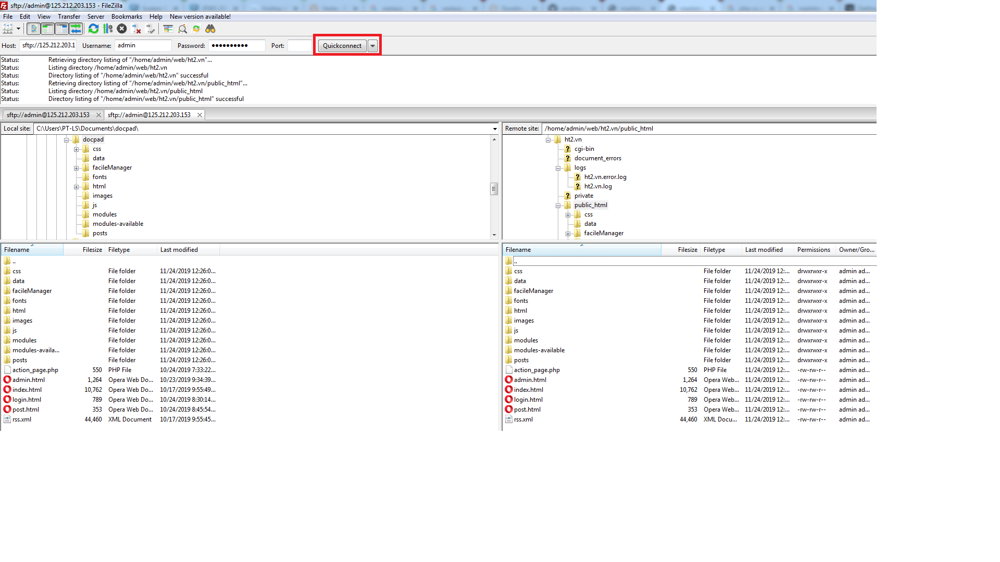
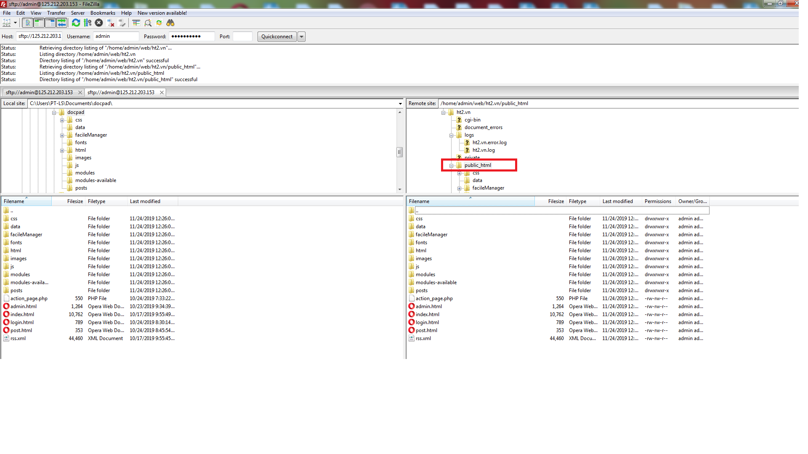

---
# __Hướng dẫn cấu hình WORDPRESS trên VESTACP__
---

## __1. Tạo wesite, cấu hình SQL DB, chứng thư SSL cho website__
Như trong user guide chung của VESTA CP: https://github.com/fagolabs/fWS/blob/master/user_guides/portal_vestacp/VESTA_CP_USER_GUIDE.md

## __2. Upload source code cho website__
### __2.1. Lấy template source code từ trang chủ wordpress về máy local__
- Tải source code từ link  https://wordpress.org/latest.tar.gz

- Giải nén file tải về, vào trong thư mục được giải nén:

- Rename file wp-config-sample.php thành wp-config.php

- Edit file wp-config.php, đổi DB_NAME, DB_USER, DB_PASSWORD tương ứng với các giá trị thiết lập khi tạo database trên VestaCP cho trang wordpress.demo.com

  Ví dụ:
  ```
  define( 'DB_NAME', 'admin_wordpress' );

  /** MySQL database username */
  define( 'DB_USER', 'admin_wordpress' );

  /** MySQL database password */
  define( 'DB_PASSWORD', '123456aA@' );
  ```

### __2.2. Đăng nhập FTP__
- Sử dụng FileZila Client để đăng nhập FTP

- Trong cửa sổ FileZila điền các thông tin sau:

  Host: sftp://<ip của server webhosting> (ví dụ: sftp://125.212.203.153)

  Username: là username sử dụng khi đăng nhập portal VestaCP (ví dụ: admin)

  Password: là password sử dụng khi đăng nhập portal VestaCP

  Port: 22

- Sau đó click Quickconnect


### __2.3. Upload source code cho website__
Trong cửa sổ FileZila, upload sourcecode (html, js, images, css, php...) vào thư mục public_html




